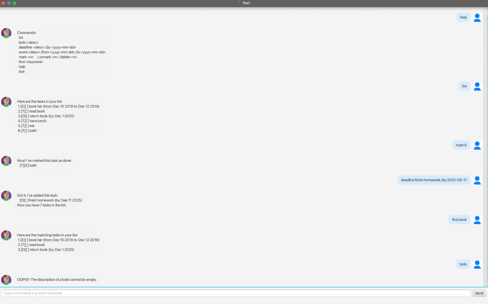

# Yuri User Guide

Yuri is a lightweight tasks chatbot with a clean JavaFX UI. It supports **todos**, **deadlines**, and **events**, plus **list**, **find**, **mark/unmark**, and **delete**. Data is saved automatically to `data/duke.txt` (created on first run).

---

## Adding deadlines

Adds a task with a due date (ISO format `yyyy-mm-dd`). The task appears in the list with a `[D]` tag and the date formatted (e.g., `Dec 2 2019`).

Example: `deadline return book /by 2019-12-02`

**Expected output**

Got it. I've added this task:   
[D][ ] return book (by: Dec 2 2019)     
Now you have 1 tasks in the list.

---

## Adding todos

Adds a task with only a description. The task appears with a `[T]` tag.

Example: `todo read book`

**Expected output**

Got it. I've added this task:   
[T][ ] read book        
Now you have 2 tasks in the list.   

---

## Adding events

Adds a task with a start and end date (ISO format). The task appears with an `[E]` tag and a `from ... to ...` range.

Example: `event book fair /from 2019-12-10 /to 2019-12-12`

**Expected output**

Got it. I've added this task:   
[E][ ] book fair (from: Dec 10 2019 to: Dec 12 2019)    
Now you have 3 tasks in the list.

---

## Listing tasks

Shows all tasks in order, numbered from 1.

Example: `list`

**Expected output**

Here are the tasks in your list:    
1.[E][ ] book fair (from: Dec 10 2019 to: Dec 12 2019)  
2.[T][ ] read book  
3.[D][ ] return book (by: Dec 2 2019)

---

## Marking tasks

Marks a task as done using its number from `list`.

Example: `mark 2`

**Expected output**

Nice! I've marked this task as done:    
[T][X] read book

---

## Unmarking tasks

Marks a task as not done.

Example: `unmark 2`

**Expected output**

OK, I've marked this task as not done yet:  
[T][ ] read book

---

## Deleting a task

Removes a task by its number.

Example: `delete 3`

**Expected output**

Noted. I've removed this task:  
[D][ ] return book (by: Dec 2 2019)     
Now you have 2 tasks in the list

---

## Finding tasks

Searches for tasks whose descriptions contain a keyword (case-insensitive).

Example: `find book`

**Expected output**

Here are the matching tasks in your list:   
1.[E][ ] book fair (from: Dec 10 2019 to: Dec 12 2019)  
2.[T][ ] read book

---

## Exiting the app

Closes Yuri.

Example: `bye`

**Expected output**

Bye. Hope to see you again soon!

---

## Running the app

Requires Java 17 and the fat JAR (`yuri.jar`).

Example:

java -jar yuri.jar